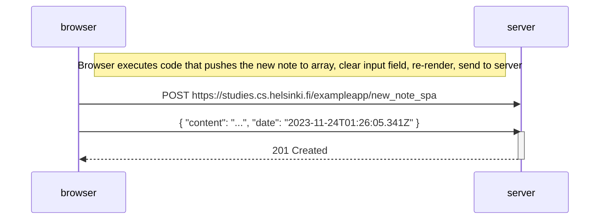

```mermaid
sequenceDiagram
    participant browser
    participant server

    Note right of browser: Browser executes code that pushes the new note to array, clear input field, re-render, send to server
    browser->>server: POST https://studies.cs.helsinki.fi/exampleapp/new_note_spa
    browser->>server: { "content": "...", "date": "2023-11-24T01:26:05.341Z" }
    activate server
    server-->>browser: 201 Created
    deactivate server
```